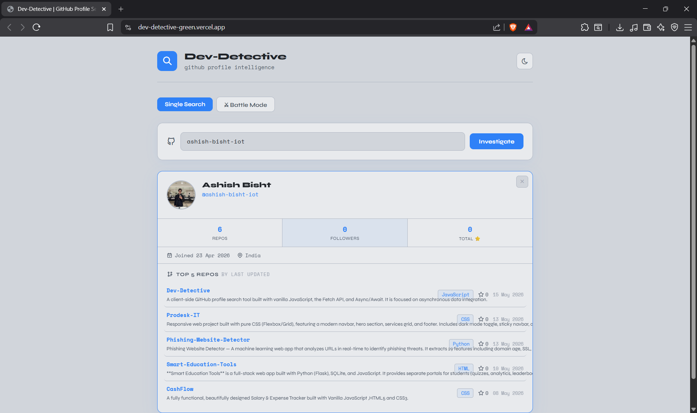
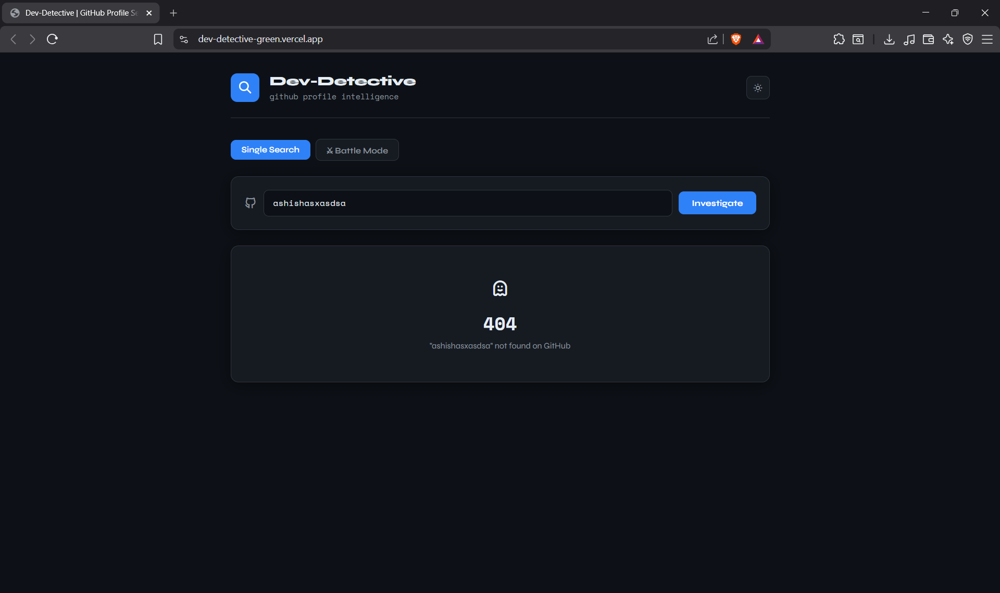
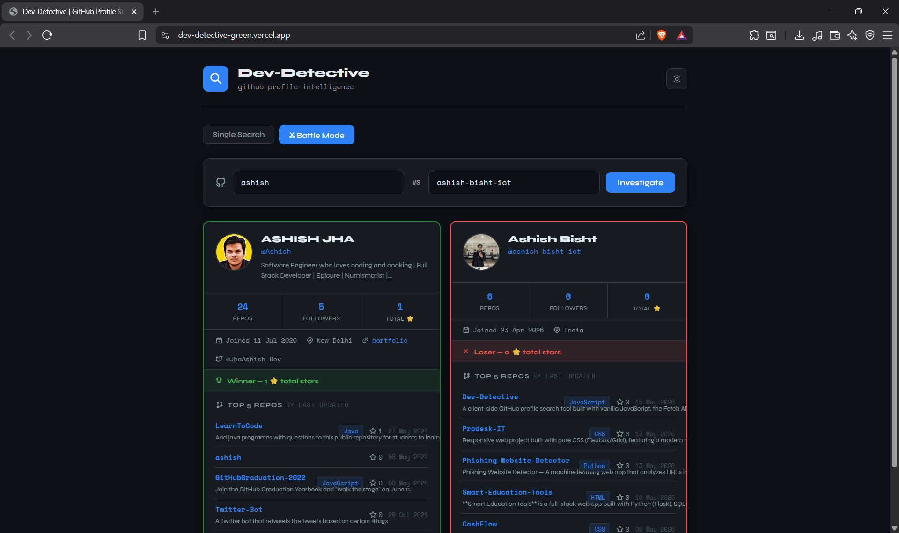
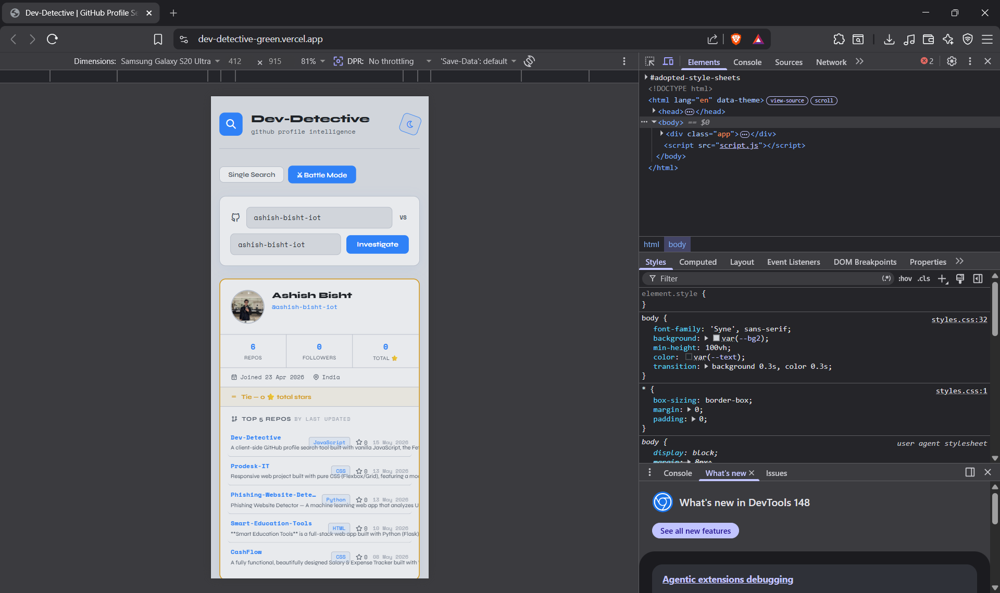
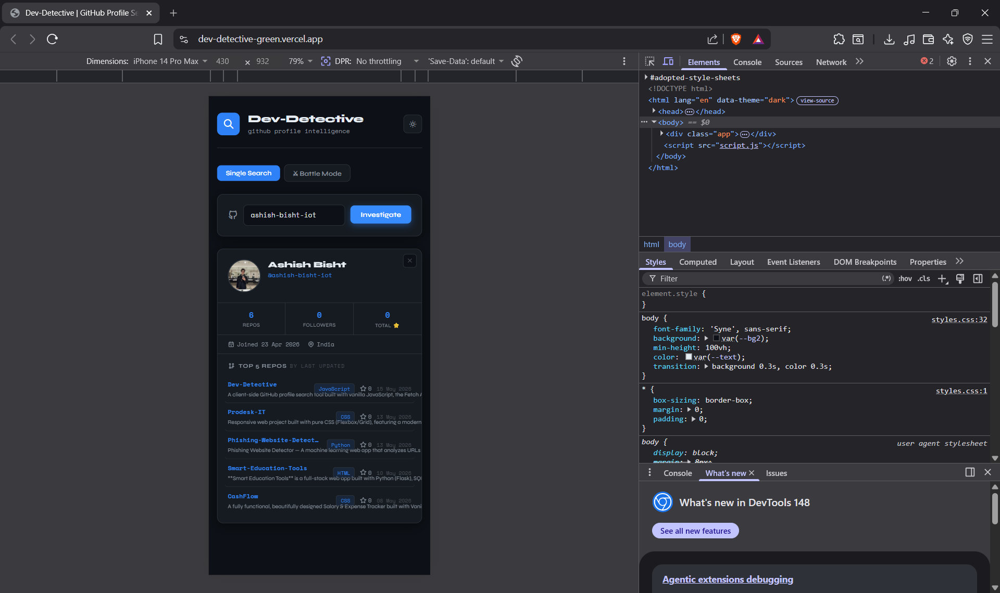
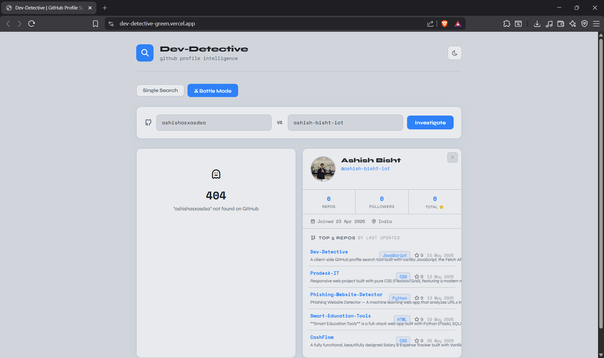

# Dev-Detective 🔍

A client-side GitHub profile search tool built with vanilla JavaScript, the Fetch API, and Async/Await. Focused on asynchronous data integration.

---

## What it does

- Search any GitHub username and instantly pull their profile data from the GitHub REST API
- Displays avatar, name, bio, location, join date, followers, Twitter, and portfolio link
- Fetches and lists their **Top 5 most recently updated repositories** with star count, language, and last updated date
- Calculates **total stars** across all public repos
- **Battle Mode** — enter two usernames and compare them head to head using `Promise.all()`
- Clean loading and error states — handles 404s gracefully without crashing
- **Tie detection** — if both users have equal stars, both cards show as Tie instead of both showing as Winner
- **Independent 404 in Battle Mode** — if one user is not found, their side shows a 404 error while the other side still shows the profile card normally
- **Dark / Light theme toggle** — persists across refreshes
- **Data persistence** — last search result, inputs, theme, and mode are all saved to localStorage and restored on refresh
- **Search history suggestions** — click the input to see previously searched usernames as a dropdown, with live filtering as you type
- **Close button on profile card** — dismiss any card with a ✕ button without refreshing the page

---

## Phases completed

| Phase | Feature | Status |
|-------|---------|--------|
| Phase 1 | Search input + Profile Card + Async fetch | ✅ Done |
| Phase 1 | Loading spinner state | ✅ Done |
| Phase 1 | 404 / Error fallback state | ✅ Done |
| Phase 2 | Endpoint chaining (repos_url) | ✅ Done |
| Phase 2 | Top 5 repos with clickable links | ✅ Done |
| Phase 2 | ISO date formatting utility | ✅ Done |
| Phase 3 | Battle Mode with Promise.all() | ✅ Done |
| Phase 3 | Total stars via reduce() | ✅ Done |
| Phase 3 | Winner / Loser / Tie conditional UI | ✅ Done |

### Bonus features (beyond requirements)

| Feature | Status |
|---------|--------|
| Dark / Light theme toggle | ✅ Done |
| Independent 404 per side in Battle Mode | ✅ Done |
| localStorage persistence on refresh | ✅ Done |
| Search history suggestions dropdown | ✅ Done |
| Permanent suggestion removal | ✅ Done |
| Close button on profile card | ✅ Done |
| Numbers formatted as 1.2k | ✅ Done |
| Repo language badge + star count | ✅ Done |
| Animated fade-in on cards | ✅ Done |
| Enter key support for search | ✅ Done |

---

## Tech used

- HTML / CSS / Vanilla JavaScript
- GitHub REST API (`https://api.github.com/users/{username}`)
- Native `fetch()` API
- `async/await` + `Promise.all()`
- `localStorage` for data persistence
- No libraries, no frameworks, no build tools

---

## How to run

No setup needed. Just open the file:

```bash
# Clone the repo
git clone https://github.com/YOUR_USERNAME/dev-detective.git

# Open in browser
open index.html
```

Or just download the folder and double-click `index.html`.

---

## API used

**GitHub REST API**
- Profile endpoint: `GET https://api.github.com/users/{username}`
- Repos endpoint: `GET {repos_url}?sort=updated&per_page=10`

> Note: GitHub limits unauthenticated requests to **60 per hour**. If you hit a 403 error, wait a bit or add a Personal Access Token (PAT) in the request headers.

---

## Key concepts practised

- `async/await` for handling Promises
- Sequential endpoint chaining (using data from one fetch to trigger another)
- `Promise.all()` for parallel async requests
- `Array.reduce()` for calculating totals
- DOM manipulation for dynamic rendering
- Error handling with `try/catch`
- `localStorage` for persistence across sessions
- Dynamic dropdown UI with event listeners

---

## Project structure

```
dev-detective/
├── index.html      # App structure and markup
├── script.js       # All JavaScript logic
├── styles.css      # All styling and theme variables
├── Prompts.md      # AI prompts used during development
└── README.md       # This file
```

---

## Screenshots

### Single Search


### 404 Error State


### Battle Mode


### Android View


### iphone View


### 404 error state in battle mode
.
---

Built as part of **Sprint 03 — Asynchronous Data Integration** at Prodesk IT.
